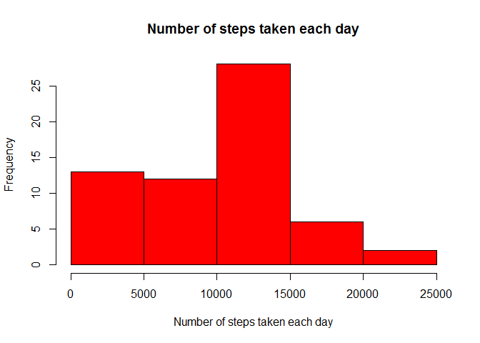
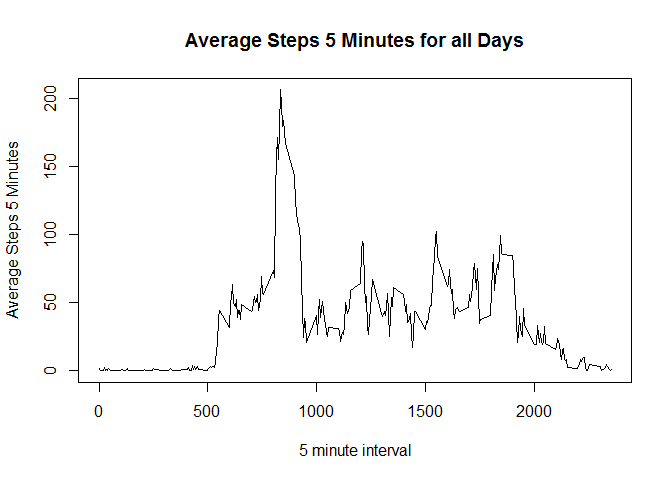
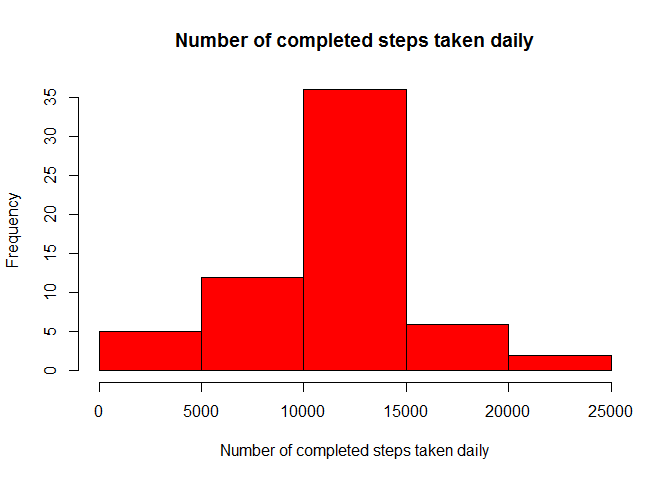

# Reproducible Research: Peer Assessment 1


## Loading and preprocessing the data
1.Load the data

```r
setwd('c:/users/marc.haserodt/repdata_peerassessment1')
activity <- read.csv("activity.csv")

str(activity)
```

```
## 'data.frame':	17568 obs. of  3 variables:
##  $ steps   : int  NA NA NA NA NA NA NA NA NA NA ...
##  $ date    : Factor w/ 61 levels "2012-10-01","2012-10-02",..: 1 1 1 1 1 1 1 1 1 1 ...
##  $ interval: int  0 5 10 15 20 25 30 35 40 45 ...
```

```r
head(activity)
```

```
##   steps       date interval
## 1    NA 2012-10-01        0
## 2    NA 2012-10-01        5
## 3    NA 2012-10-01       10
## 4    NA 2012-10-01       15
## 5    NA 2012-10-01       20
## 6    NA 2012-10-01       25
```

```r
summary(activity)
```

```
##      steps                date          interval     
##  Min.   :  0.00   2012-10-01:  288   Min.   :   0.0  
##  1st Qu.:  0.00   2012-10-02:  288   1st Qu.: 588.8  
##  Median :  0.00   2012-10-03:  288   Median :1177.5  
##  Mean   : 37.38   2012-10-04:  288   Mean   :1177.5  
##  3rd Qu.: 12.00   2012-10-05:  288   3rd Qu.:1766.2  
##  Max.   :806.00   2012-10-06:  288   Max.   :2355.0  
##  NA's   :2304     (Other)   :15840
```
## What is mean total number of steps taken per day?
1.Calculate the total number of steps taken per day

```r
dailyStep <- aggregate(activity$steps, by = list(date = activity$date),
                        FUN = sum, na.rm = TRUE)
```
2.Make a histogram of the total number of steps taken each day

```r
hist(dailyStep$x, col = "red", xlab = "Number of steps taken each day",
     main = "Number of steps taken each day")
```

<!-- -->

3.Calculate and report the mean and median of the toal number of steps taken per day.

```r
meanDailyStep <- mean(dailyStep$x)
medianDailyStep <- median(dailyStep$x)
```
Mean = 

```r
meanDailyStep
```

```
## [1] 9354.23
```
Median = 

```r
medianDailyStep
```

```
## [1] 10395
```

## What is the average daily activity pattern?
1.Make a time series plot

```r
min5IntSteps <- aggregate(activity$steps, by = list(interval =
                        activity$interval), FUN = mean, na.rm = TRUE)
plot(min5IntSteps$interval, min5IntSteps$x, type = "l",
     ylab = "Average Steps 5 Minutes", xlab = "5 minute interval",
     main = "Average Steps 5 Minutes for all Days")
```

<!-- -->

2.Which 5-minute interval contains the max number of steps?

```r
stepMax <- max(min5IntSteps$x)
min5IntMax <- min5IntSteps[which(min5IntSteps$x == stepMax),]$interval

stepMax
```

```
## [1] 206.1698
```

```r
min5IntMax
```

```
## [1] 835
```

## Imputing missing values

1.Calculate and report the total number of missing values in the dataset

```r
good <- complete.cases(activity)  

missingNum <- nrow(activity[!good, ])

missingNum
```

```
## [1] 2304
```
2.Devise a strategy for filling in missing values and  

3.Create a new dataset with the completed information

```r
avgStepInt <- aggregate(activity$steps, by = list(interval = activity$interval),
                        FUN = mean, na.rm = TRUE)

len <- nrow(activity)
completedSteps <- vector(mode = "integer", length = len)
for (i in 1:len) {
        if (is.na(activity$steps[i])) {
                indx <- which(avgStepInt$interval == activity$interval[i])
                if (!is.nan(avgStepInt$x[indx]))     {
                        completedSteps[i] <- round(avgStepInt$x[indx])
                }
                else    {
                        completedSteps[i] <- 0
                }
        }
        else    {
                completedSteps[i] <- activity$steps[i]
        }
}

completedActivity <- activity
completedActivity$steps <- completedSteps
dailySteps <- aggregate(completedActivity$steps, by = 
                                list(date = completedActivity$date), FUN = sum)
```

4.Make a histogram and report the mean and median total number of steps taken per day

```r
hist(dailySteps$x, col = "red", xlab = "Number of completed steps taken daily",
     main = "Number of completed steps taken daily")
```

<!-- -->

```r
meanDailySteps <- mean(dailySteps$x)
medianDailySteps <- median(dailySteps$x)
```
Mean

```r
meanDailySteps
```

```
## [1] 10765.64
```
Median

```r
medianDailySteps
```

```
## [1] 10762
```


## Are there differences in activity patterns between weekdays and weekends?  
1.Create a new factor variable in the dataset with two levels - "weekday" and "weekend"

```r
completedActivity$dayInd <- factor(ifelse(weekdays(as.Date(completedActivity$date,
                                        "%Y-%m-%d"), abbreviate = TRUE) %in%
                                        c("Sat", "Sun"), "weekend", "weekday"))
min5IntSteps <- aggregate(completedActivity$steps, by = list(interval =
                        completedActivity$interval,
                        dayInd = completedActivity$dayInd), FUN = mean)
```
2.Make a panel plot

```r
library(lattice)
xyplot(x ~ interval | dayInd, data=min5IntSteps, xlab="Interval",
       ylab="Number of steps", layout=c(1,2), type="l")
```

<!-- -->
